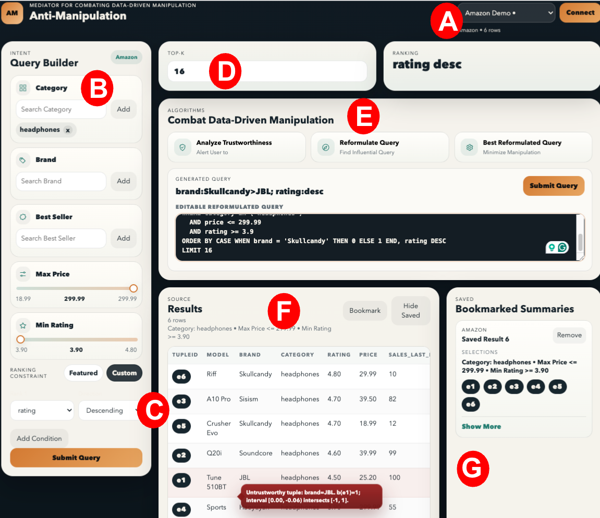
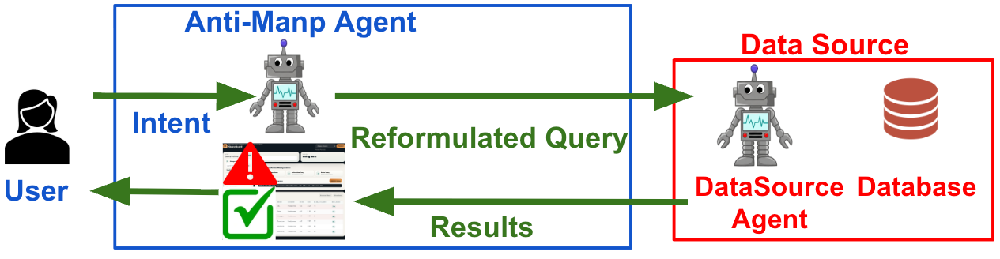

# Anti-Manipulation

Anti-Manipulation is a Flask prototype of the demo system.



This repository is meant to be easy to hand off. It already has:

- a working Flask backend,
- a dataset-aware frontend,
- bundled demo datasets,
- stable API contracts between UI and backend,
- sample algorithm hooks that can be replaced by a real implementation.


## Paper Context

The paper frames Anti-Manipulation as a mediator for querying data sources that may have incentives to manipulate rankings.

Core ideas from the paper that this prototype mirrors:

- A user has an **intent**: the ranking they actually want.
- The data source may return a **biased interpretation** of that intent.
- Anti-Manipulation helps the user:
  - inspect the returned top-k result,
  - flag untrustworthy tuples,
  - generate a query reformulation,
  - improve that reformulation,
  - compare the updated result against the original one.


The paper’s demonstration section uses three dataset families:

- **Amazon**
  - Manipulation scenario: a shopping site may promote low-rated, slow-selling, or otherwise preferred products.
  - Example attributes: `rating`, `sales in the last month`, `price`.
- **PriceRunner**
  - Manipulation scenario: a comparison platform may favor certain sellers.
  - Example attributes: `seller`, `product model`, `product category`.
- **Flights**
  - Manipulation scenario: a booking platform may favor certain airlines or price patterns.
  - Example attributes: `airline`, `days until departure`, `price`.

The paper’s running demo scenario over Amazon uses:

- `category = headphones`
- `price < 20`
- ranking by `rating`
- top-16 style inspection
- trust analysis that can flag tuples like JBL / Haoyuyan
- a CASE-based reformulation that promotes `Skullcandy` and demotes `JBL`

This repository keeps that headphone example intact in the bundled sample data.

## Project Goals

This codebase is designed to help a developer do the next implementation step quickly.

That means:

- the data loading path is simple and centralized,
- the UI behavior is already aligned with the paper demo,
- the request/response contracts are stable,
- the places where the real backend should plug in are clearly marked,
- the demo can already be run by a tester without extra setup beyond Python dependencies.

## Current Implementation Status

### What is real

- Flask app and REST API routes
- Dataset catalog dropdown
- Schema detection and normalization for the three paper dataset families
- Dynamic query builder that changes by dataset
- Multi-select categorical filters
- Numeric sliders
- Ranking builder with `Featured` and `Custom`
- Multi-attribute custom ranking
- Top-k control
- Saved result summaries with persistent browser storage
- Styled result table and row highlighting

### What is placeholder

- `check_influential_equilibrium`
- `detect_untrustworthy_tuples`
- `find_influential_query`
- `improve_user_utility`
- `Featured` ranking mode
- source-side bias modeling heuristics

All placeholder logic lives behind stable helper functions in [algorithms.py](/Users/aryal/Desktop/QueryGuard/algorithms.py) or the small demo ranking helpers in [app.py](/Users/aryal/Desktop/QueryGuard/app.py).

## Repository Layout

- [app.py](/Users/aryal/Desktop/QueryGuard/app.py)
  - Flask app
  - dataset normalization
  - ranking flow
  - API routes
- [algorithms.py](/Users/aryal/Desktop/QueryGuard/algorithms.py)
  - sample algorithm hooks that mimic the paper workflow
- [templates/index.html](/Users/aryal/Desktop/QueryGuard/templates/index.html)
  - main page layout
- [static/app.js](/Users/aryal/Desktop/QueryGuard/static/app.js)
  - dynamic UI rendering
  - query submission
  - saved result persistence
- [static/styles.css](/Users/aryal/Desktop/QueryGuard/static/styles.css)
  - app styling
- [sample_data/amazon_headphones.csv](/Users/aryal/Desktop/QueryGuard/sample_data/amazon_headphones.csv)
  - running-example demo dataset
- [sample_data/amazon_products_with_categories.csv](/Users/aryal/Desktop/QueryGuard/sample_data/amazon_products_with_categories.csv)
  - larger Amazon-style dataset
- [sample_data/pricerunner_aggregate.csv](/Users/aryal/Desktop/QueryGuard/sample_data/pricerunner_aggregate.csv)
  - PriceRunner-style dataset
- [sample_data/flights_bucketized.csv](/Users/aryal/Desktop/QueryGuard/sample_data/flights_bucketized.csv)
  - flights dataset
- [docs/HANDOFF.md](/Users/aryal/Desktop/QueryGuard/docs/HANDOFF.md)
  - developer handoff notes
- [docs/TESTING.md](/Users/aryal/Desktop/QueryGuard/docs/TESTING.md)
  - tester checklist

## Architecture

### 1. Dataset loading

When the user selects a data source, the frontend calls `/api/load-dataset`.

The backend then:

1. reads just the header,
2. detects whether the dataset is Amazon, PriceRunner, or Flights,
3. maps raw columns to canonical names,
4. computes filter metadata,
5. returns UI metadata to the frontend.

This lets the frontend stay generic.

### 2. Original query flow

When the user clicks `Run Query`, the frontend sends:

- selected filters,
- ranking mode,
- primary ranking attribute and direction,
- secondary ranking attribute and direction,
- top-k.

The backend then:

1. applies filters,
2. computes the clean intent ranking,
3. computes a visible ranking using either:
   - the demo biased source behavior, or
   - the placeholder `featured` ranking,
4. returns the visible top-k rows.

### 3. Analysis flow

- `Analyze Trustworthiness`
  - backend flags suspicious tuples
  - frontend highlights those rows
- `Find Influential`
  - backend returns a first reformulation
  - frontend shows the generated query card
- `Improve Query`
  - backend returns a refined reformulation
  - frontend updates the generated query card
- `Submit Query`
  - backend applies the last reformulation
  - frontend refreshes the result table

### 4. Saved result flow

The right panel stores complete result summaries, not individual tuples.

Each saved entry records:

- dataset label,
- selected filters,
- ranking mode,
- primary and secondary ranking,
- top-k,
- summary text,
- generated constraint when relevant,
- tuple ids shown,
- timestamp.

These saved summaries are stored in browser local storage.

## Dataset Support

### Bundled sources

The dropdown currently exposes four demo sources:

- `Amazon Headphones Demo`
- `Amazon Products`
- `PriceRunner Aggregate`
- `Flights Bucketized`

### Accepted formats

The backend loader currently supports:

- `.csv`
- `.json`
- `.jsonl`
- `.parquet`

### Expected canonical fields

Amazon-style:

- `model`
- `brand`
- `category`
- `rating`
- `price`
- `best_seller`
- `sales_last_month`

PriceRunner-style:

- `offer_title`
- `product_model`
- `seller`
- `product_category`
- `product_id`
- `cluster_id`

Flights-style:

- `airline`
- `source`
- `destination`
- `travel_class`
- `stops`
- `days_until_departure`
- `duration`
- `price`

The loader also accepts common alias names and normalizes them.

## Running the App

From [Anti-Manipulation](/Users/aryal/Desktop/QueryGuard):

```bash
python3 -m venv .venv
source .venv/bin/activate
pip install -r requirements.txt
python app.py
```

Open [http://127.0.0.1:5000](http://127.0.0.1:5000).

## Recommended Demo Walkthrough

Use `Amazon Headphones Demo`.

Suggested demo steps aligned with the paper:

1. Keep `category = headphones`.
2. Set `Max Price` to `20`.
3. Set `Min Rating` to `4`.
4. Rank by `rating desc`.
5. Keep `Top-K = 16`.
6. Click `Run Query`.
7. Click `Analyze Trustworthiness`.
8. Click `Find Influential`.
9. Click `Submit Query`.
10. Click `Improve Query`.
11. Click `Submit Query` again.
12. Save the result summary on the right for comparison.

## API Summary

### `GET /api/catalog`

Returns the curated dropdown catalog.

### `POST /api/load-dataset`

Input:

```json
{ "path": "/absolute/path/to/file.csv" }
```

Returns dataset-aware UI metadata.

### `POST /api/query`

Runs the original query.

### `POST /api/analyze`

Flags suspicious tuples in the current visible result.

### `POST /api/find-influential`

Generates the first reformulation.

### `POST /api/improve-query`

Generates the improved reformulation.

### `POST /api/submit-query`

Applies the last generated reformulation.

## Where the Real Backend Should Go

The main replacement points are:

- [algorithms.py](/Users/aryal/Desktop/QueryGuard/algorithms.py)
  - replace sample algorithm functions with real logic
- [app.py](/Users/aryal/Desktop/QueryGuard/app.py)
  - replace `_bias_score`, `_rank_by_biased_source`, and `_rank_featured`
  - keep request/response contracts stable if possible

The UI already expects:

- flagged row ids from trust analysis,
- a `relativeConstraint`,
- a `reformulation.queryText`,
- a reformulation that can be submitted later.

## Limitations

- This is a prototype, not a production service.
- The backend keeps one active dataset/query session in memory.
- Saved result summaries are stored in browser local storage, not in a database.
- The research algorithms are not yet implemented.
- The current bias behavior is heuristic and demo-only.

## Handoff Docs

- Developer notes: [docs/HANDOFF.md](/Users/aryal/Desktop/QueryGuard/docs/HANDOFF.md)
- Tester checklist: [docs/TESTING.md](/Users/aryal/Desktop/QueryGuard/docs/TESTING.md)
